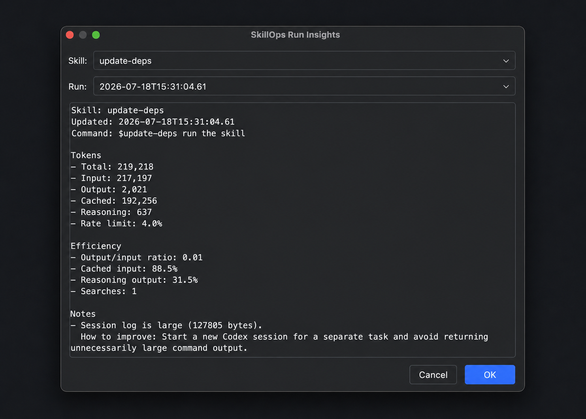
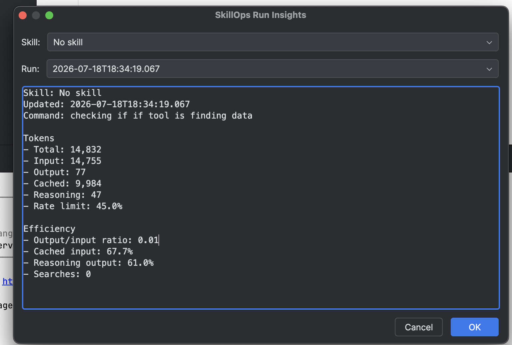
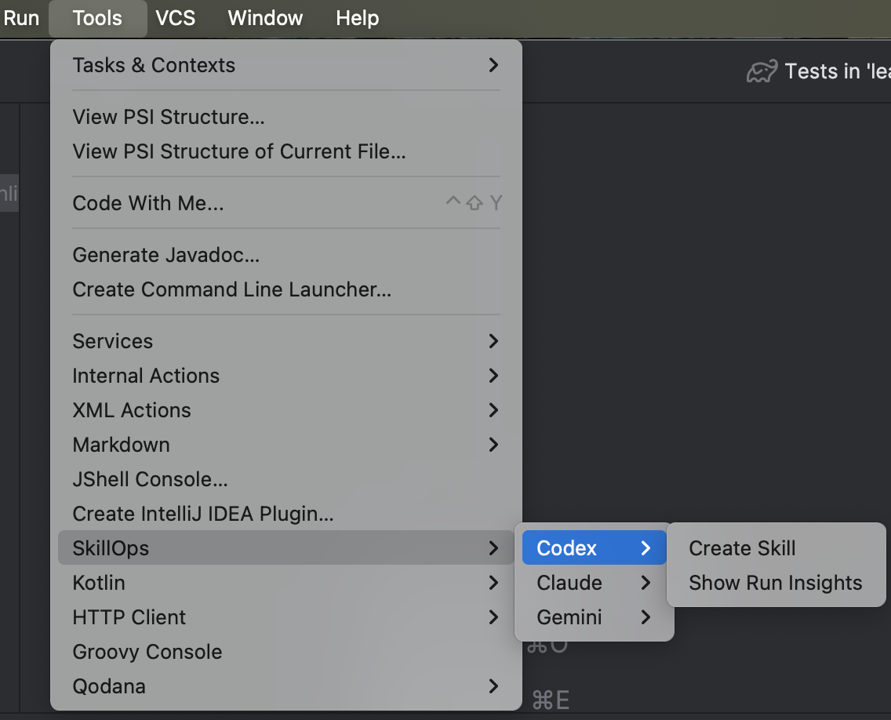

SkillOps Plugin
=================

[](https://github.com/spmisha134/skillOps-intellij/actions/workflows/build.yml?query=branch%3Amaster)
[](https://plugins.jetbrains.com/plugin/32994-skillops)

SkillOps is an IntelliJ IDEA plugin that creates repository-scoped skills for Codex, Claude Code, and Gemini CLI.
It generates platform-specific skill directories, keeps `SKILL.md` focused, and writes supporting references, scripts, and assets. Codex runs can also be reviewed with local run insights.

SkillOps works locally and does not upload project files, prompts, session logs, credentials, or analytics.



SkillOps also reports Codex sessions that did not invoke a skill. These appear under `No skill`, while the Run dropdown provides the timestamped history for each separate session.



Useful links
------------

- [Product requirements](docs/product/PRODUCT_REQUIREMENTS.md)
    - Defines the user workflow, generated skill structure, and out-of-scope product behavior.
- [Architecture](docs/architecture/ARCHITECTURE.md)
    - Documents package boundaries between IntelliJ integration, generation, insights, and presentation.
- [Development and publishing runbook](docs/development/RUNBOOK.md)
    - Describes local verification, packaging, release, signing, and Marketplace publication steps.
- [SkillOps on JetBrains Marketplace](https://plugins.jetbrains.com/plugin/32994-skillops)
    - Install the latest public release and view compatibility information.

How to install
--------------

Install SkillOps directly from JetBrains Marketplace using the IDE preferences:

```text
IntelliJ IDEA
→ Settings/Preferences
→ Plugins
→ Marketplace
→ Search for "SkillOps"
→ Install
```

You can also open the [public SkillOps Marketplace page](https://plugins.jetbrains.com/plugin/32994-skillops).

How to use
----------

Create a skill from the IntelliJ project view:

```text
Tools
→ SkillOps
→ Codex, Claude, or Gemini
→ Create Skill
```

The plugin creates the selected platform's project skill directory (`.agents/skills/` for Codex, `.claude/skills/` for Claude, or `.gemini/skills/` for Gemini). A Codex skill contains:

```text
.agents/
  skills/
    <skill-name>/
      SKILL.md
      references/
        instructions.md
        validation.md
        examples.md
      scripts/
      assets/
      agents/
        openai.yaml
```

Review token usage and efficiency after a Codex run:

```text
Tools
→ SkillOps
→ Codex
→ Show Run Insights
```

Open the IntelliJ **Tools** menu and follow the nested SkillOps and Codex menus:



Run insights scan recent Codex JSONL sessions from the configured Codex home and show token totals, input/output split, cached-token percentage, reasoning-token percentage, repository/search activity, rate-limit status, and session-size warnings. Skill runs are grouped by skill name; ordinary project sessions remain available under `No skill`, with separate timestamped history entries.

Questions and Feedback?
-----------------------

Use [GitHub Issues](https://github.com/spmisha134/skillOps-intellij/issues) for bugs, workflow problems, and feature requests.

When reporting a problem, include:

- IntelliJ IDEA version
- SkillOps version
- operating system
- steps to reproduce
- expected and actual behavior

Contributing
------------

See [CONTRIBUTING.md](CONTRIBUTING.md) for the development workflow and pull-request checklist. Before contributing, read:

- [AGENTS.md](AGENTS.md)
- [Product requirements](docs/product/PRODUCT_REQUIREMENTS.md)
- [Architecture](docs/architecture/ARCHITECTURE.md)

Keep pull requests focused. Include what changed, why it changed, and how it was verified.

How to build
------------

```bash
./gradlew buildPlugin
```

Note that the above won't run tests and checks. To do that too, run:

```bash
./gradlew check buildPlugin
```

For the complete list of tasks, see:

```bash
./gradlew tasks
```

How to run UI tests
-------------------

This project does not currently include UI integration tests.

Manual IDE verification is done with:

```bash
./gradlew runIde
```

Then verify:

```text
Tools → SkillOps → Codex → Create Skill
Tools → SkillOps → Claude → Create Skill
Tools → SkillOps → Gemini → Create Skill
Tools → SkillOps → Codex → Show Run Insights
```

How to develop in IntelliJ
--------------------------

Import the project as a Gradle project using JDK 21.

Whenever you change a Gradle setting, for example `build.gradle.kts`, `settings.gradle.kts`, or `gradle.properties`, refresh all Gradle projects from the Gradle toolbar.

To run an IntelliJ instance with the plugin installed:

```bash
./gradlew runIde
```

Plugin Verification
-------------------

The project uses the IntelliJ Platform Gradle Plugin verification tasks.
To run local verification:

```bash
./gradlew check
./gradlew verifyPlugin
```

Release
-------

The first public release is `0.1.0`.
Release steps, signing requirements, and Marketplace publication notes are maintained in [docs/development/RUNBOOK.md](docs/development/RUNBOOK.md).

License
-------

Licensed under the [Apache License, Version 2.0](LICENSE).
